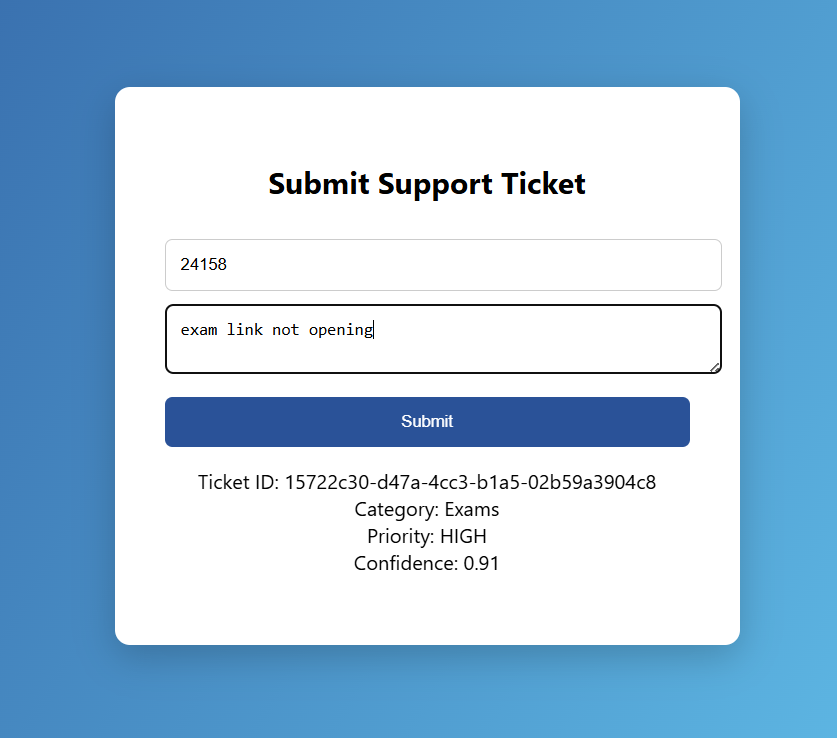
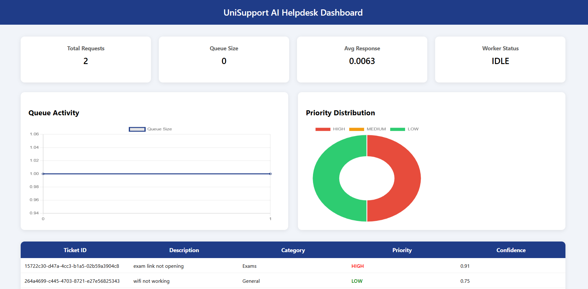

# 🚀 ResolveIT AI — Smart IT Helpdesk Platform

🚧 Status: MVP (Startup-Grade Prototype)

An AI-powered IT Service Management (ITSM) platform designed to automate IT support operations inside companies.

Inspired by tools like HaloITSM, Zendesk, and Jira Service Management.

---

## ✨ Key Features

### 🤖 AI Ticket Classification
- Automatically detects issue category
- Predicts priority (Low / Medium / High)
- Provides confidence score

### ⚙️ Event-Driven Architecture
- Queue-based processing system
- Background worker execution
- Scalable backend design

### 📊 Admin Dashboard
- Live ticket monitoring
- Queue size tracking
- Worker status
- Priority distribution charts
- Real-time updates

### 👨‍💻 Client Portal
- Submit IT issues
- Instant AI classification
- Auto priority detection
- Success confirmation UI

---

## 🧠 Tech Stack

| Layer        | Technology |
|-------------|------------|
| Backend     | Python |
| Server      | HTTPServer |
| Database    | SQLite |
| Queue       | Python Queue |
| AI Model    | Rule-based (ML-ready) |
| Frontend    | HTML, CSS, Chart.js |

---

## 🏗 System Architecture

```text
┌───────────────┐
│ Client Portal │
└───────┬───────┘
        ↓
┌───────────────┐
│   API Layer   │
└───────┬───────┘
        ↓
┌──────────────────────┐
│ AI Classification    │
└───────┬──────────────┘
        ↓
┌───────────────┐
│ Queue System  │
└───────┬───────┘
        ↓
┌───────────────┐
│ Worker Engine │
└───────┬───────┘
        ↓
┌───────────────┐
│   Database    │
└───────┬───────┘
        ↓
┌────────────────────┐
│ Admin Dashboard    │
└────────────────────┘


## 🚀 How to Run


```bash
git clone https://github.com/thakursahab2580-lgtm/ai-helpdesk-system.git
cd ai-helpdesk-system
python ticket_system.py

## 📸 Screenshots

### Dashboard


### Client Portal
